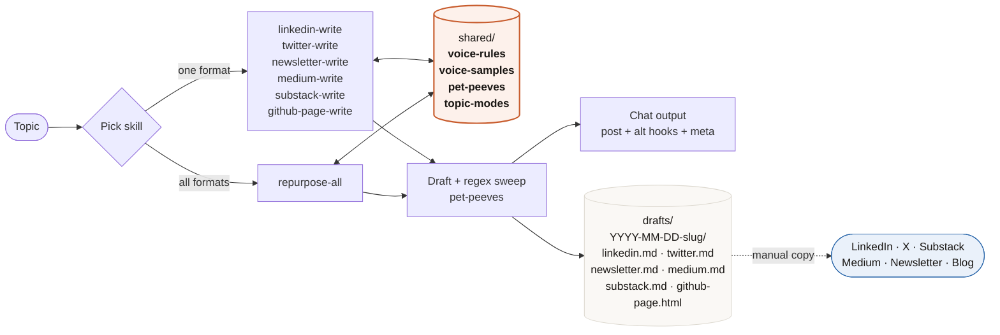

# content-repurposer-skill

[](LICENSE) [](https://claude.com/claude-code) 

**Drafts for:**


A Claude Code plugin for drafting technical writing across six formats from a single topic — **in your voice**, not generic LLM marketing voice. Plus an orchestrator that produces all formats in one pass.

Given a topic, one skill drafts for one format. Pick the format you want; the skill loads a shared voice profile, classifies the topic, and writes. Or invoke `repurpose-all` to get every format at once. The default voice profile in this repo is calibrated to Anuj Sadani ([asadani.github.io](https://asadani.github.io/)) — a Principal SDE writing about AI engineering, security, and engineering leadership. The interesting part isn't his voice; it's the **mechanism** for capturing yours. See [Make This Yours](#make-this-yours).

## What you get

Six format skills, one orchestrator, one shared voice profile, no marketing fluff:

| Skill                 | Format                                                  | Length        | Register                       |
|-----------------------|---------------------------------------------------------|---------------|--------------------------------|
| `linkedin-write`      | LinkedIn post (asks length intent per run)              | 500-2400 ch   | Sharp / contrarian             |
| `twitter-write`       | Tweet or thread on X (asks mode: quote/opinion/share/wow/thread) | ≤280 ch or 3-7 tweets | Sharpest / most compressed     |
| `substack-write`      | Substack post                                           | 600-1200 w    | Sharp / contrarian             |
| `newsletter-write`    | Newsletter issue (subject + preheader + body)           | 300-600 w     | Between sharp and measured     |
| `medium-write`        | Medium article                                          | 1500-3000 w   | Measured engineer              |
| `github-page-write`   | Hand-rolled HTML post for a static blog (two themes)    | 1800-2800 w   | Measured engineer, long-form   |
| `repurpose-all`       | **Orchestrator** — one topic, drafts across every format you select, in one pass | varies | Adapts per format              |

## Why this differs from other writing skills

Most LinkedIn writing skills are built for marketers.

This one is built for engineers who write.

Marketing-shaped skills come with the whole funnel attached: a viral-post database to copy from, profile optimizers, engagement analytics, employee advocacy modules, follower-graph segmentation. The substance is buried under wrapping.

I stripped the wrapping.

**What this does that others don't:**

- **Six formats, one voice.** LinkedIn, Twitter/X, Newsletter, GitHub Pages, Medium, Substack all read from the same `shared/voice-rules.md`. Edit one file, every skill picks up the change.
- **Your voice is a file, not a slider.** No tone presets. The unit of truth is `shared/voice-samples.md`, populated with your real openings verbatim. The model pattern-matches against them.
- **Pet peeves enforced with regex.** A blacklist runs against every draft before delivery: em-dashes as sentence joiners, rule-of-three triplets, marketing words like "unlock" or "supercharge", engagement-bait closers like "drop a comment". Hits get regenerated, not shipped.
- **No marketing surface area.** No profile optimizer. No engagement analytics. No "best time to post" calculator. No viral-post database of other people's content. If it doesn't help you write better in your own voice, it isn't in here.
- **Built to fork.** The five files in `shared/` are example data, not prescription. `Make This Yours` is its own section in this README.

What you give up: this won't help you go viral. It will help you sound like yourself across six formats without writing six times.

## Install

Clone wherever you keep your tools:

```bash
git clone https://github.com/asadani/content-repurposer-skill.git
cd content-repurposer-skill
./install.sh
```

The script symlinks the seven skills into `~/.claude/skills/`. Pass a path as the first argument to override: `./install.sh /custom/skills/dir`. **Restart your Claude Code session** to pick them up.

If you prefer manual install:

```bash
mkdir -p ~/.claude/skills
for s in linkedin-write twitter-write newsletter-write github-page-write medium-write substack-write repurpose-all; do
  ln -sfn "$(pwd)/skills/$s" ~/.claude/skills/$s
done
```

## Use

After restarting your session, invoke any skill by name.

**Single-format invocations:**

```
Use linkedin-write to draft a post about why agentic systems fail in production despite passing benchmarks.

Use twitter-write — topic: AI shrinkflation in frontier models.

Use github-page-write for a write-up on the recent litellm supply chain attack.

medium-write — topic: contextual retrieval is a chunk-level upgrade, not a retrieval strategy.
```

Each single-format skill asks any clarifying questions (length, mode, theme) before drafting.

**Repurpose across formats in one pass:**

```
Use repurpose-all on this topic: why most teams ship agentic systems that pass evals but fail in production.
```

The orchestrator asks once which formats you want (default: all six), then drafts every selected format in one response — using sensible defaults so you aren't interrupted with per-format questions. For `github-page-write` it produces a Markdown skeleton; run `github-page-write` separately on the same topic when you want the styled HTML file.

**Nothing is auto-posted or auto-committed in any workflow.**

### Where drafts are saved

Every skill writes its output to a per-topic directory under `./drafts/` (in addition to printing in the chat). Path convention:

```
./drafts/<YYYY-MM-DD>-<topic-slug>/
  linkedin.md
  twitter.md
  newsletter.md
  medium.md
  substack.md
  github-page.html                   # only when github-page-write runs
  github-page-skeleton.md            # only when repurpose-all runs
```

Re-running the same topic on the same day suffixes with `-v2`, `-v3` so older drafts are preserved. `drafts/` is in `.gitignore` — it never gets committed to the plugin repo.

**Push-readiness:**
- LinkedIn, Twitter, Newsletter, Medium, Substack → copy from the `.md` file into the platform's compose window.
- GitHub Pages → copy `github-page.html` as `<your-blog-slug>/index.html` into your blog repo and commit. The HTML is self-contained (inline CSS, no external assets).

### Emoji control

Default emoji level is **`low`** — most drafts contain zero emoji. To change for a single invocation, just say so:

```
Use linkedin-write — topic: ai shrinkflation — use medium emoji
Use twitter-write — topic: contextual retrieval — no emoji
repurpose-all — topic: agent failures in production — high emoji
```

Levels: `none` (zero, ever), `low` (one if genuinely useful), `medium` (1-2 per piece, may serve as section markers), `high` (per-bullet decoration). Each format has its own ceiling — see `shared/voice-rules.md`. Twitter caps at 1 emoji per tweet even at `medium`; LinkedIn never uses emoji as bullet leads.

## Example

Here is what `linkedin-write` produces on a representative topic, using the default voice profile shipped in `shared/`.

**You:**

> Use linkedin-write to draft a post about why agentic systems pass evals but fail in production.

**Skill (asks once):**

> Length? **short** (<500 chars, single observation+implication), **medium** (~1300 chars, hook+2-3 paras+payoff), or **long** (~2000+ chars, mini-essay)?

**You:**

> medium

**Skill returns:**

```
─── POST ───
Evals measure what you remembered to test. Production measures what you forgot.

I've watched three agentic systems this year ship with 90%+ eval scores
and fail roughly half of the cases their first-week users threw at them.
The systems weren't broken. The evals were.

What the evals didn't catch:
- users who paste 8KB of unstructured email and expect a structured answer
- tool calls that succeed but return a shape the agent doesn't know how to consume
- retries that pile context and shift the model's behavior at turn 7
  in ways turn 1 never sees

You can't out-eval this. You can't generate adversarial sets that resemble
what real users do, because real users don't behave adversarially. They
behave indifferently. Most prod failures aren't attacks. They're inputs
nobody on the team thought to fabricate.

What I'd do instead: assign one engineer per week to read 50 real
production traces. No tooling. No dashboard. Just read them. The patterns
you'll find are not patterns your eval generator will produce.

The eval suite tells you what passes. The traces tell you what failed
before you knew to test for it.

─── ALTERNATE HOOK 1 ───
Same agent. 95% eval pass. 40% production fail. The systems aren't broken.
The evals are.

─── ALTERNATE HOOK 2 ───
Three agentic systems shipped this year with green dashboards and red
user feedback. The dashboards weren't lying. They were just measuring
the wrong thing.

─── META ───
characters: 1247
hashtags: none
hook pattern used: dichotomy
```

A few things this demonstrates about how the skill behaves:

- **First person, owned opinion.** "I've watched...", "What I'd do instead..." — never "we should" or "engineers must."
- **Real numbers.** "90%+ eval scores," "three agentic systems this year," "50 real production traces" — not "significantly worse" or "much faster."
- **No engagement-bait closer.** Ends with a callback to the opening dichotomy, not "What do you think?"
- **No em-dash sentence joiners, no rule-of-three triplets, no marketing words.** The regex sweep in `shared/pet-peeves.md` runs against every draft before delivery.

For a sense of what `github-page-write` produces, look at any post on [asadani.github.io](https://asadani.github.io/) — for example, [Moral Surrender](https://asadani.github.io/moral-surrender/) (warm-light theme, leadership topic) or [litellm supply chain attack](https://asadani.github.io/litellm-supply-chain-attack/) (dark-cyberpunk theme, security topic).

## How it works



**The five shared files (the unit of truth):**

| File                       | Purpose                                                                 |
|----------------------------|-------------------------------------------------------------------------|
| `shared/voice-rules.md`    | Voice register, per-format dial, emoji control, encouraged patterns, identity context |
| `shared/voice-samples.md`  | Verbatim openings/closings from real posts — calibration anchors        |
| `shared/pet-peeves.md`     | Hard blacklist (forced engagement, em-dashes, marketing hype) + regex   |
| `shared/topic-modes.md`    | Topic → mode map (security / agents / leadership / cost-infra)          |
| `shared/platform-styles.md`| Per-platform style: audience, technical depth, headline aggressiveness, density + precedence |

Each skill's `SKILL.md` is short and points at these shared files. Tweak the shared files and every skill picks up the change immediately — no per-skill duplication.

The `shared/` directory is symlinked into each skill folder (`skills/<name>/shared/`) so SKILL.md can reference it with single-level relative paths — portable across forks and install locations.

## Make This Yours

This is the part worth reading. The mechanism here is generic; the voice profile in `shared/` is just one example. To use this plugin in your own voice:

### Step 1 — Replace `shared/voice-rules.md`

This is the single most important file. Replace its content with your own:

- Your identity (role, years of experience, what you're known for).
- Your default register (do you write contrarian-sharp, measured, story-driven, dry-technical?).
- Per-format tone dial (some formats sharper than others?).
- Topic-to-mode adjustments (a security write-up vs a leadership essay should sound different — define how).
- Closer style preferences.
- Words and phrases YOU use (look at your last 10 posts — what recurs?).

### Step 2 — Populate `shared/voice-samples.md` with your real writing

Paste **4-6 verbatim openings** from your own published posts. Maybe 2-3 closings as well. These are calibration anchors. The model will pattern-match against them.

Do NOT paste your full posts — just the cadence-bearing fragments. The shape, not the substance.

### Step 3 — Edit `shared/pet-peeves.md`

The defaults here (em-dashes, rule-of-three, marketing hype) are good universal bans for AI-flavored prose. Add your own personal pet peeves. Remove anything you DO want to use.

Update the regex sweep at the bottom to match. The skills run that regex against every draft before delivering.

### Step 4 — Adjust `shared/topic-modes.md`

If you write about different topics than the default (security / agents / leadership / cost-infra), rename and re-bucket the modes. Each mode has triggers, a voice register, structural defaults, and example posts.

### Step 5 — Tune `shared/platform-styles.md`

Voice stays the same across platforms; *style* shifts by audience. Edit the profile table to match where you publish — set technical depth, headline aggressiveness, and density per platform for your audience mix, and rewrite the per-platform notes. Keep the axis scales and precedence rules; the skills depend on that structure.

### Step 6 — Update each SKILL.md description and the README

The frontmatter `description:` in each `skills/<name>/SKILL.md` still mentions "Anuj's voice." Change to yours. Same for this README (or fork it and rewrite).

### Step 7 — Update `github-page-write` for your own site

This skill is hardcoded to fetch templates from `asadani/asadani.github.io` (a hand-rolled HTML site with two themes). If your blog is different:

- **Jekyll/Hugo/MkDocs etc.:** rewrite this skill's SKILL.md to output your site's preferred format (Markdown with frontmatter, typically). Drop the live-fetch step.
- **Your own hand-rolled site:** change the `gh api repos/asadani/asadani.github.io/...` calls to point at your repo and your template paths.
- **No blog:** delete this skill entirely.

### Step 8 — Reinstall

If you cloned and ran `install.sh`, just restart your Claude Code session. The skills are symlinked, so edits to `shared/` and `skills/*/` propagate immediately.

If you forked and want to publish your version, push to your own GitHub.

## Plugin manifest

The repo includes `.claude-plugin/plugin.json` for compatibility with Claude Code's plugin marketplace system. The simpler symlink-into-skills-dir install (above) bypasses the marketplace and works without registering the plugin anywhere.

## What's deliberately NOT in here

- **Auto-publish integrations.** No LinkedIn API, no Substack API, no Twitter API, no Publora. The skill drafts; you review and post manually. This is intentional — content posted on autopilot is content nobody reads twice.
- **Self-reference / backlink suggestions.** No "as I argued in my previous post" auto-injection.
- **LinkedIn-marketing tooling** (profile optimizer, thread monitor, engager analytics, employee advocacy programs). Those belong in a different tool aimed at marketers.

A note on `repurpose-all`: the orchestrator exists but is **not** the default workflow. Each format usually deserves its own attention, and cross-posting the same thing to all six is often the wrong call. Use the orchestrator when a topic is genuinely worth multiple platforms; use single-format skills the rest of the time.

If you want any of these, fork and add them.

## License

Apache 2.0. See [LICENSE](./LICENSE).

The `shared/voice-rules.md`, `shared/voice-samples.md`, and `shared/topic-modes.md` files in this repo encode Anuj Sadani's voice profile and are provided as an example. If you publish a fork, please replace these with your own voice before publishing or distributing.

## Credits

Built by [Anuj Sadani](https://asadani.github.io/). The mechanism distills lessons from a handful of LinkedIn-writer skills floating around in the Claude Code ecosystem — voice-rule structure, draft-then-approve flow — with the marketing-influencer surface area stripped off.
